# Clinica Online
## UTN 4°A

Alumno: Agnoli, Luca Nahuel

Profesores: Octavio Villegas | Agustín Friadenrich

## Inicio - Registro
<table>
  <tr>
    <td>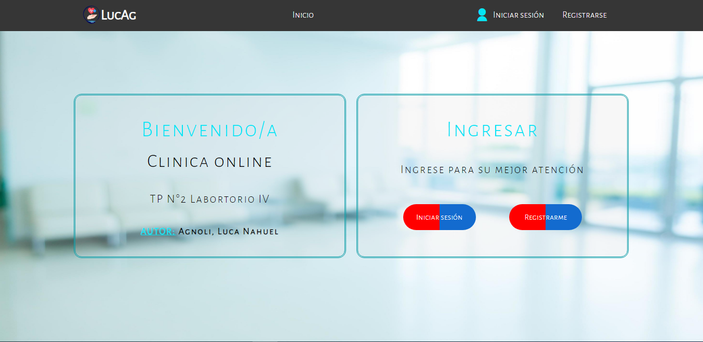</td>
    <td>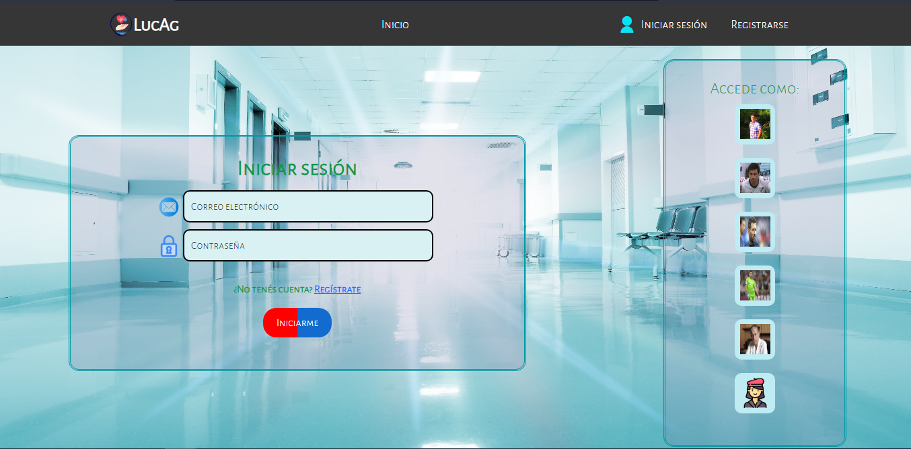</td>
    <td>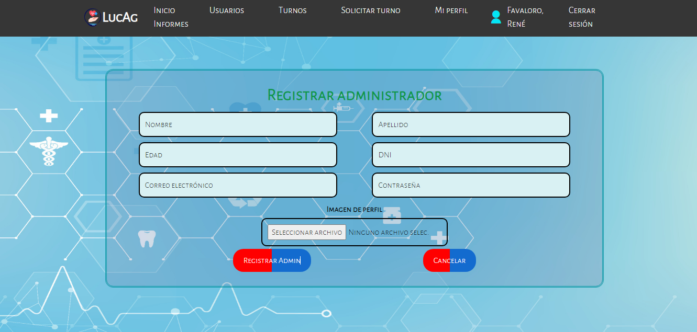</td>
    <td>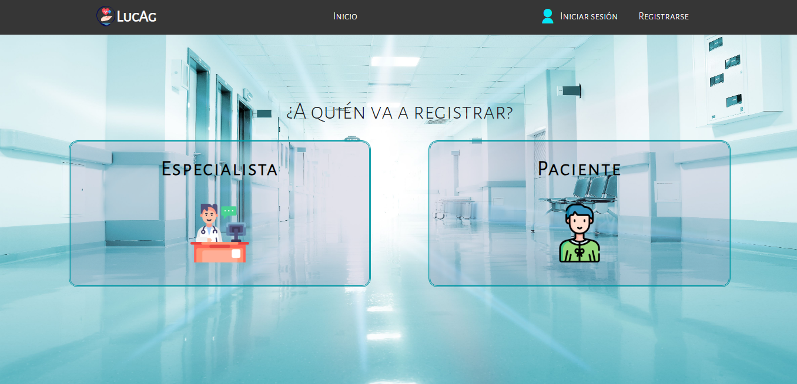</td>
    <td>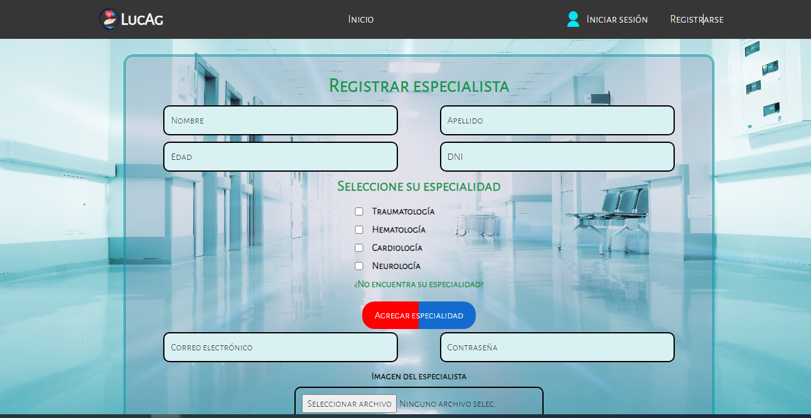</td>
  </tr>
</table>
## Perfiles
<table>
  <tr>
    <td>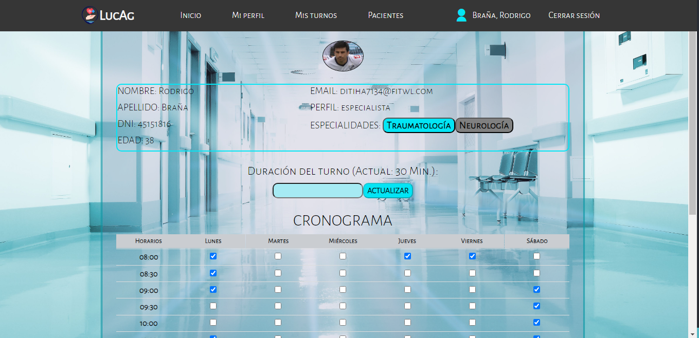</td>
    <td>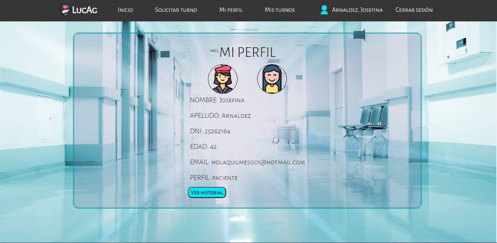</td>
    <td>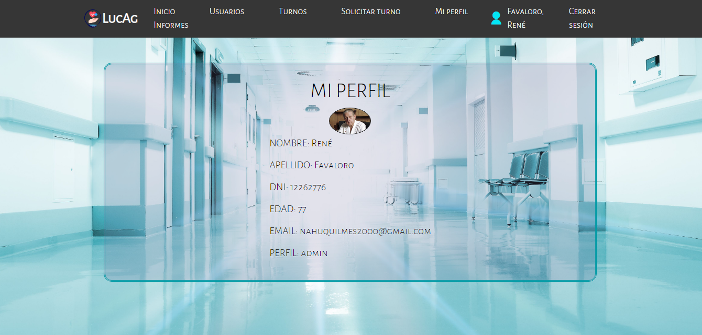</td>
   
  </tr>
</table>

  ## Turnos - Usuarios
<table>
  <tr>
    <td>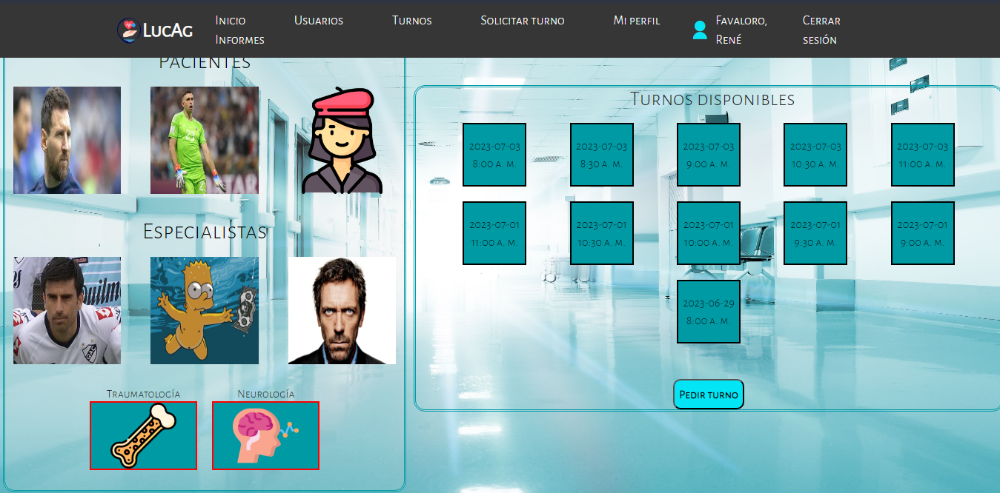</td>
    <td>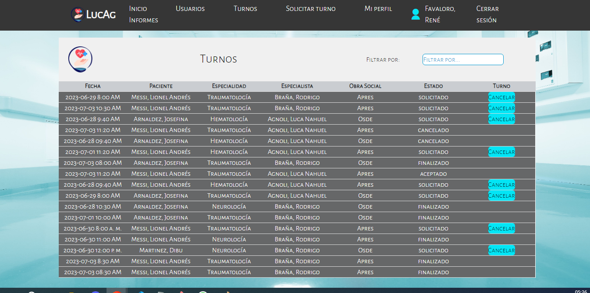</td>
    <td>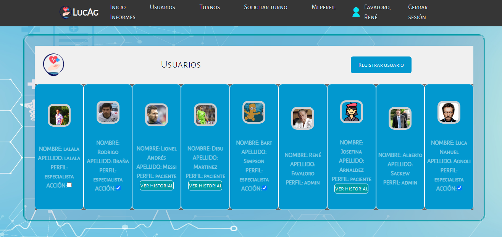</td>
    <td>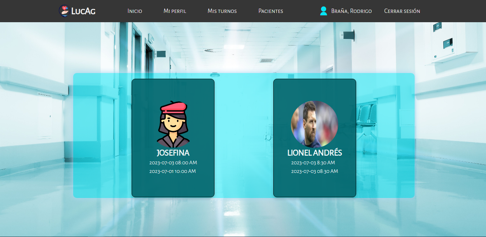</td>
  </tr>
</table>
## Informes
<table>
  <tr>
    <td>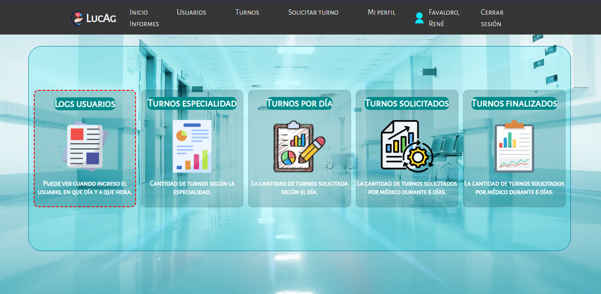</td>
  </tr>
</table>
